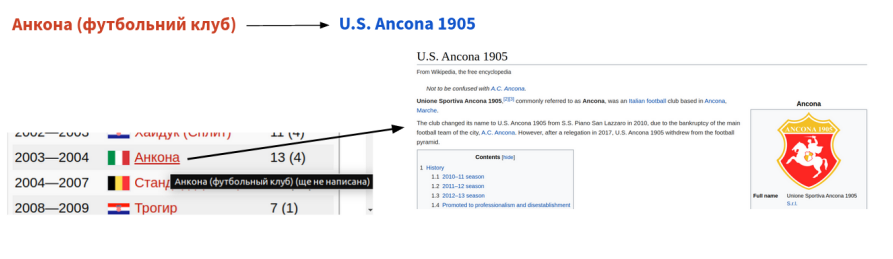

Matching Ukrainian Red Links with English Wikipedia’s Articles

--------------------------------------------------------------------------------

**THE REPOSITORY IS IN THE PROCESS OF REFACTORING**

This repository contains code that handles a dataset of Ukrainian red links (https://doi.org/10.6084/m9.figshare.11550774) and reproduces experiments of the project 'Matching red links with Wikidata' (Master thesis in the Faculty of Applied Sciences, Ukrainian Catholic University) and the paper 'Matching Ukrainian red links with English articles' (Companion Proceedings of the Web Conference 2020 (WWW '20 Companion)).

### Task Formulation

Red links are links to pages which do not exist (either not yet created or have been deleted). The problem of red links is that they can refer to Wikidata items or Wikipedia articles which already exist in other languages, but can not been identified from the source language. We tackle this problem as a Named Entity Linking task and propose a solution for matching Ukrainian red links to English Wikipedia articles.

Here is an example of a red link in Ukrainian Wikipedia ("Анкона"/Ankona) and an existent English Wikipedia page ("U.S.Ancona 1905") that should be matched.

### Load raw Data

go to the folder 'data' and run
> ./get_data.sh

The dataset will be loaded to 'data' folder [YOU NEED ~ 600 MB]

### The Dataset

The dataset can be uploaded here:
https://doi.org/10.6084/m9.figshare.11550774

The dataset is obtained from Wikimedia dump of Ukrainian Wikipedia and English editions from 20th of September, 2018.
Table 'ukredlinks_final.csv' is a dataset of the most frequent 3 171 Ukrainian red links. They occur in 20 or more articles which have corresponding articles in English Wikipedia.
Table 'ukredlinks_pairs_final.csv' consists of 2 957 927 pairs which are red links and their candidate pages from English Wikipedia. The pairs are created as a dictionary for Named Entity Linking task.

The general statistics of the dataset:

|                              |   train     |   test    |
|------------------------------|-------------|-----------|
|  # red links sample          |  2 537      |  634      |
|  # red link-candidate pairs  |  2 337 270  |  620 657  |

The detailed analysis of the dataset could be found here [DATA_ANALYSIS](materials/data.md)

### Methods

We use graph and word properties of Wikipedia articles and apply different similarity metrics to find the correspondent items in English Wikipedia for Ukrainian red links.
Our similarity metrics are based on the following approaches:
1. Jaccard similarity on incoming links;
2. Jaccard similarity on concurrent links;
3. Levenshtein edit distance on red link and English candidate article title;
4. Cross-lingual word-embedding of red link and English candidate article title;
5. Graph embedding of parts of Ukrainian and English Wikipedia.

Then we combine the results of these independent similarity models into a multi-factor linear model (linear regression).

Finally we compare the results of these independent and combined metrics with the results of BabelNet knowledge base considering the last as our baseline. Among all the applied techniques we present the similarity model that produces the best results.

### Result

Part of a dataset. Ukrainian red link 'Емад Мотеаб' and candidate articles from English Wikipedia among which the right one 'Emad Moteab' should be chosen.

|  red link    |  candidate                                 |
|--------------|--------------------------------------------|
|  Емад Мотеаб | Mengistu Worku                             |
|  Емад Мотеаб | Luciano Vassalo                            |
|  Емад Мотеаб | Wael Gomaa                                 |
|  Емад Мотеаб | Mudashiru Lawal                            |
|  Емад Мотеаб | Ali Bin Nasser                             |
|  Емад Мотеаб | Emad Moteab                                |
|  Емад Мотеаб | James Pritchett (footballer)               |
|  Емад Мотеаб | Federation of Uganda Football Associations |

The graph embedding similarity model failed due to technical limitations of the device. \
The cross-lingual word-embedding similarity approach succedeed in topic classification but failed to match the exact items.
The best result was achieved with multi-factor model based on independent similarity models (Jaccard similarity on incoming links, Jaccard similarity on concurrent links, Levenshtein edit distance on titles). 

The F1 score on provided 'test' set is **85 %**.

Below are evaluation results on similarity metrics as independent models and on a multi-factored model based on the results of the independent ones. (The best $F_1$ score is in bold)

|  Similarity metrics               |  fp   |  tn    |  tp   |  fn   |  P      |  R      |  F_1       |
|-----------------------------------|-------|--------|-------|-------|---------|---------|------------|
|  BabelNet                         |  4    |  65    |  108  |  456  |  0.964  |  0.191  |  0.32      |
|  Incoming links (top1, th=0.26)   |  385  |  149   |  64   |  37   |  0.143  |  0.634  |  0.233     |
|  Concurrent links (top1, th=0.1)  |  263  |  360   |  2    |  10   |  0.008  |  0.167  |  0.014     |
|  Levenshtein (top1, th=0.39)      |  295  |  24    |  41   |  275  |  0.122  |  0.13   |  0.126     |   
|  Multi-factored model (top1)      |  31   |  1445  |  339  |  90   |  0.92   |  0.79   |  **0.85**  | 

### How to reproduce results & repo details

#### repo structure

    ├── data                         # [folder] Dataset & dataset partitions 
    │   ├── substitured-words        # [folder] Original up-packed dataset
    │   │   └── test.src             # test.src is left in repo in order to run the model
    │   │   └── val.src              # val.src is left in repo in order to run the model
    │   │   └── val.lbl              # val.lbl is left in repo in order to run the model        
    ├── materials                    # [folder] Different Materials
    │   ├── images                   # [folder] Images for README files
    │   ├── logs                     # [folder] Log files (symlink to output folder)
    │   ├── models                   # [folder] Trained models and their config files
    │   │   └── roberta_ds_2m        # [folder] Best model (after uploading or training)     
    │   │   └── roberta_ds_2m.yaml   # Config file for the best model    
    │   │   └── ... .yaml            # Other config files        
    │   ├── results                  # [folder] Results on validation and test sets
    │   │   └── val_final.lbl        # Result on validation set obtained with the best model   
    │   │   └── val_final.lbl.eval   # Evaluation results obtained on val_final.lbl
    │   │   └── test_final.lbl       # Result on test set obtained with the best model          
    │   ├── data.md                  # Data analysis details
    │   ├── task.md                  # Task description    
    ├── notebooks                    # [folder]Jupyter notebooks 
    │   └── 01_data_analysis.ipynb   # Jupyter notebook with data analysis
    │   └── 02_model_ngram.ipynb     # Jupyter notebook with ngram related material    
    │   └── 03_model_nnlm_lstm.ipynb # Jupyter notebook with nnlm and lstm model related material
    │   └── 04_model_berts.ipynb     # Jupyter notebook with transformer related material
    └── src                          # [folder] Source files 
    │   ├── dataset                  # [folder] Source files related to data
    │   ├── models                   # [folder] Source files related to models
    │   ├── thirdparty               # [folder] Files to run 'transformers' scripts for training
    │   └── eval.py                  # Original 'eval.py' file
    │   └── prepare_data.py          # Dataset sub-set generation, preparation for 'transformers'
    │   └── train.py                 # Training of models (currently only n-gramm, nnlm, lstm)
    │   └── test.py                  # Testing of models
    └── test                         # [folder] Test files for some source files              
    ├── README.md
    └── requrements.txt

#### dependencies

Data retrieval was based on the Final project for the [Mining Massive Datasets course at the Ukrainian Catholic University, 2018](https://github.com/olekscode/Power2TheWiki) where the author was a part of the team.

Cross-lingual approach to similarity model was implemented on the basis of [Introduction to cross-lingual word-embeddings at Wikimania 2019](https://github.com/digitalTranshumant/TutorialCrossLingualEmbeddings) library.
Graph-embedding approach to similarity model was implemented on the basis of [GEM](https://github.com/palash1992/GEM) library. 

The detailed list of relevant dependencies and libraries version could be found in 
[requirements.txt](requirements.txt) file. 

#### how to reproduce (the main result)

WORK IN PROGRESS
